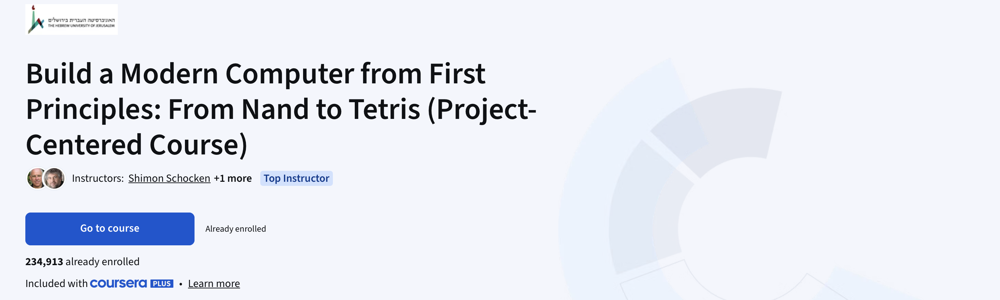

## 概述

  

理解计算机工作原理的最佳方式是从零开始构建一台，这本教材通过十二章内容和项目，引导学习者逐步搭建一个简单但功能强大的计算机系统的硬件平台与软件层级。在此过程中，学习者会获得硬件、体系结构、操作系统、编程语言、编译器、数据结构与算法以及软件工程方面的实践知识。通过这种建构式方法，本书向读者介绍了大量计算机科学知识，并将关键的理论与应用技术整合到一个建构式框架中。这一成果被称为 “从与非门到俄罗斯方块”：一段从最基础的逻辑门（名为与非门）出发，经过十二个项目后，最终构建出一台通用计算机系统的旅程 —— 这台计算机能运行俄罗斯方块，以及任何你能想到的其他程序。

## 配套 Coursera 课程

> 在这门项目导向型课程中，你将完成从硬件到软件的完整计算机系统搭建：既会从零开始构建现代计算机硬件，也会搭建适配它的软件层级架构，以一套连贯的实操项目走完计算机系统从底层到上层的完整流程。
>
> 我们会把这段探索拆分为系列实操项目，首先带你从构建基础逻辑门起步，一步步实现一台功能完备的通用计算机 —— 在此过程中，你将以最直接、最具建设性的方式，理解计算机的底层工作原理与硬件设计逻辑。
>
> 在此基础上，你还将搭建一套现代软件层级架构，目标是让基于对象的高级语言能在这台极简硬件平台上完成翻译与执行：具体而言，你会为一门类 Java 的简易编程语言实现虚拟机与编译器，并开发一个基础操作系统，以此填补高级语言与底层硬件之间的技术鸿沟；而在这一过程中，你将通过实操深入掌握应用计算机科学的众多核心主题，比如栈处理、语法解析、代码生成，以及内存管理、矢量图形、输入输出处理对应的经典算法与数据结构 —— 这些内容，正是所有现代计算机系统的核心支柱。

作者同步推出了两门与本书配套的 以项目为导向的 Coursera 课程，向全球学习者免费开放，可访问 <a href="https://www.coursera.org/instructor/shimon">作者主页</a> 查询课程详情并注册参与。申请助学金（Financial Aid）即可解锁全部课程资源及作业在线测评功能，旁听用户则可通过本地工具完成项目测评。

## 证书

  

  

